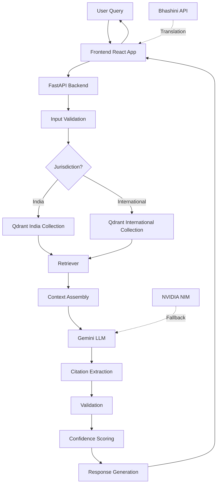

# AyurPedia 🌿

[](https://fastapi.tiangolo.com)
[](https://reactjs.org)
[](https://langchain.com)
[](https://qdrant.tech)
[](LICENSE)

**Smart India Hackathon 2026** | Ayurvedic IPR & Regulatory AI Assistant

AyurPedia is a multilingual AI-powered legal and regulatory assistant for Ayurvedic Intellectual Property Rights (IPR), Patent regulations, and Traditional Knowledge compliance. It helps practitioners, researchers, AYUSH startups, and cultivators navigate the complex intersection of Ayurveda formulations and intellectual property law.

## Key Features 🚀

- 🏷️ **Formulation Classification**: Categorize herbal products under 7 regulatory classes (Classical, Proprietary, Ayurveda-Aahar, Cosmetic, Phytopharmaceutical, etc.)
- 🔍 **Patentability Analysis**: Clarify Section 3(p) restrictions against patenting traditional knowledge, novelty requirements, and synergistic bio-enhancers
- 📜 **Regulatory Frameworks**: Guidance on Indian Patents Act 1970, Biological Diversity Act 2002 (NBA approval), FSSAI regulations, and international treaties
- 💬 **AI-Powered Chat**: Interactive Q&A with citation enforcement and confidence scoring
- 🌐 **Multilingual Support**: 10+ Indian languages via Bhashini API translation
- 🔄 **Jurisdiction Toggle**: Switch between India and International legal frameworks
- ✅ **Citation Enforcement**: All answers backed by verified legal document citations
- 🛡️ **Safe Abstention**: Gracefully handles out-of-scope queries with appropriate disclaimers

## Architecture 🏗️



## Tech Stack 🛠️

| Component | Technology | Purpose |
|-----------|-----------|---------|
| **Backend Framework** | FastAPI 0.104.1 | REST API server |
| **LLM Orchestration** | LangChain 0.3.0 | RAG pipeline management |
| **Workflow Engine** | LangGraph 0.2.0 | Classification workflow |
| **Primary LLM** | Google Gemini 2.5 Flash | Response generation |
| **Fallback LLM** | NVIDIA NIM DeepSeek | Backup generation |
| **Embeddings** | Cohere embed-english-v3.0 | 1024-dim vector embeddings |
| **Vector Database** | Qdrant Cloud | Document storage & retrieval |
| **Frontend Framework** | React 18 | User interface |
| **Build Tool** | Vite | Fast development & bundling |
| **Styling** | Tailwind CSS | Utility-first CSS |
| **Translation** | Bhashini API | Multilingual support |
| **Document Parsing** | LlamaParse | PDF extraction |
| **Data Validation** | Pydantic | Type safety |

## Project Structure 📁

```
AyurPedia/
├── backend/                      # FastAPI Backend
│   ├── app/
│   │   ├── core/                # Configuration, database, LLM client
│   │   │   ├── config.py       # Environment configuration
│   │   │   ├── database.py     # Qdrant vector database
│   │   │   └── llm.py          # LLM client with fallback
│   │   ├── ingestion/           # Document processing pipeline
│   │   │   ├── parser.py       # PDF parsing with LlamaParse
│   │   │   ├── chunker.py      # Document chunking
│   │   │   ├── embedder.py     # Cohere embedding generation
│   │   │   └── loader.py       # Qdrant upsert logic
│   │   ├── rag/                 # RAG system
│   │   │   ├── retriever.py    # Jurisdiction-aware retrieval
│   │   │   ├── prompts.py      # LLM prompt templates
│   │   │   └── chains.py       # RAG chain implementation
│   │   ├── graph/               # LangGraph workflow
│   │   │   ├── workflow.py     # State graph definition
│   │   │   ├── classification.py # Classification node
│   │   │   ├── routing.py      # Jurisdiction routing
│   │   │   └── validation.py   # Citation validation
│   │   ├── models/              # Pydantic models
│   │   │   ├── chat.py         # Chat request/response
│   │   │   ├── classification.py # Classification models
│   │   │   └── document.py     # Document chunk model
│   │   ├── services/            # Business logic
│   │   │   ├── chat_service.py # Chat processing
│   │   │   └── classification_service.py # Classification logic
│   │   ├── api/                 # FastAPI endpoints
│   │   │   ├── chat.py         # Chat endpoint
│   │   │   ├── classify.py     # Classification endpoint
│   │   │   └── health.py        # Health check
│   │   └── utils/               # Utilities
│   │       ├── logging.py      # Audit logging
│   │       └── validators.py   # Input validation
│   ├── scripts/                 # Utility scripts
│   │   └── run_ingestion.py    # Document ingestion
│   ├── main.py                  # FastAPI entry point
│   ├── requirements.txt         # Python dependencies
│   └── .env                     # Environment variables
├── frontend/                    # React Frontend
│   ├── src/
│   │   ├── components/          # React components
│   │   │   ├── Chat/           # Chat interface
│   │   │   ├── Classification/ # Classification UI
│   │   │   ├── Common/         # Shared components
│   │   │   └── Layout/         # Header, Footer
│   │   ├── services/            # API services
│   │   │   ├── chatApi.js      # Chat API calls
│   │   │   ├── classifyApi.js  # Classification API
│   │   │   └── translationApi.js # Bhashini translation
│   │   ├── context/             # React Context
│   │   ├── hooks/               # Custom hooks
│   │   ├── views/               # Page views
│   │   └── styles/              # CSS styles
│   ├── public/                  # Static assets
│   ├── package.json             # Node dependencies
│   └── vite.config.js           # Vite configuration
├── data/                        # Source documents
│   ├── india/                   # Indian legal documents
│   └── international/          # International treaties
├── .gitignore                   # Git ignore rules
└── README.md                    # This file
```

## Data Sources 📚

### India Collection
- **Patents Act 1970** - Complete patent law framework
- **Biological Diversity Act 2002** - NBA approval and benefit sharing
- **FSSAI Ayurveda-Aahar Regulations 2022** - Food product classification

### International Collection
- **WIPO GRATK Treaty 2024** - Genetic resources and traditional knowledge
- **TRIPS Agreement** - Trade-related intellectual property rights
- **Nagoya Protocol** - Access to genetic resources

## Prerequisites 📋

### For Backend
- Python 3.10 or higher
- pip package manager
- Qdrant Cloud account (or local Qdrant instance)
- API keys:
  - Google Gemini API
  - Cohere API
  - LlamaParse API (optional, for document ingestion)
  - NVIDIA NIM API (optional, for fallback LLM)

### For Frontend
- Node.js 18 or higher
- npm or yarn package manager

## Installation 💻

### Backend Setup

1. **Navigate to backend directory**
```bash
cd backend
```

2. **Create virtual environment**
```bash
python -m venv venv
source venv/bin/activate  # On Windows: venv\Scripts\activate
```

3. **Install dependencies**
```bash
pip install -r requirements.txt
```

4. **Configure environment variables**
```bash
cp .env.example .env
# Edit .env with your API keys
```

### Frontend Setup

1. **Navigate to frontend directory**
```bash
cd frontend
```

2. **Install dependencies**
```bash
npm install
```

## Configuration ⚙️

Create a `.env` file in the `backend/` directory:

```env
# Qdrant Configuration
QDRANT_URL=https://your-qdrant-cloud.qdrant.io
QDRANT_API_KEY=your_qdrant_api_key

# Cohere API (Embeddings)
COHERE_API_KEY=your_cohere_api_key

# LlamaParse API (Document Parsing - Optional)
LLAMAPARSE_API_KEY=your_llamaparse_api_key

# Gemini API (Primary LLM)
GEMINI_API_KEY=your_gemini_api_key
GEMINI_MODEL=gemini-2.5-flash

# NVIDIA NIM API (Fallback LLM - Optional)
NVIDIA_NIM_API_KEY=your_nvidia_api_key
NVIDIA_NIM_BASE_URL=https://integrate.api.nvidia.com/v1/chat/completions
FALLBACK_MODEL=meta/llama-3.1-405b-instruct

# Collection Names
INDIA_COLLECTION=india_corpus
INTERNATIONAL_COLLECTION=international_corpus

# RAG Parameters
EMBEDDING_DIMENSION=1024
BATCH_SIZE=100
CHUNK_SIZE=1000
CHUNK_OVERLAP=200
TOP_K_RESULTS=5
CONFIDENCE_THRESHOLD=0.7
```

## Running Locally 🚀

### Start Backend

```bash
cd backend
source venv/bin/activate  # Windows: venv\Scripts\activate
python main.py
```

The API will be available at `http://localhost:8000`

### Start Frontend

```bash
cd frontend
npm run dev
```

The frontend will be available at `http://localhost:5173`

## Usage Guide 📖

### 1. Formulation Classification

**Step 1:** Navigate to the Classification page
**Step 2:** Enter your formulation name and ingredients
**Step 3:** Select jurisdiction (India/International)
**Step 4:** Click "Classify"

**Example:**
```
Formulation: Ashwagandha Churna with Honey
Ingredients: Ashwagandha root, Honey
Jurisdiction: India
Result: Classical Ayurvedic Formulation
```

### 2. AI Chat with Citations

**Step 1:** Navigate to the Chat page
**Step 2:** Select your jurisdiction
**Step 3:** Type your legal question
**Step 4:** View response with verified citations

**Example Query:**
```
"What is Section 3(p) of the Patents Act and how does it affect Ayurvedic formulations?"
```

**Response includes:**
- Detailed explanation
- Source citations: `[Source: Patents Act 1970, Section: 3(p)]`
- Confidence score badge
- Legal disclaimer

### 3. Multilingual Support

**Step 1:** Select your preferred language from the dropdown
**Step 2:** Type your query in your language
**Step 3:** System automatically translates and responds
**Step 4:** Response translated back to your language

**Supported Languages:** Hindi, Tamil, Telugu, Bengali, Marathi, Gujarati, Kannada, Malayalam, Punjabi, Assamese

## API Endpoints 🌐

### Chat Endpoint

**POST** `/api/chat`

**Request:**
```json
{
  "query": "What is Section 3(p) of the Patents Act?",
  "jurisdiction": "India"
}
```

**Response:**
```json
{
  "response": "Section 3(p) excludes from patentability...",
  "citations": [
    {
      "text": "Patents Act 1970, Section 3(p)",
      "source": "Patents Act 1970",
      "section": "3(p)"
    }
  ],
  "confidence": "High",
  "jurisdiction": "India",
  "disclaimer": "This is information, not legal advice."
}
```

### Classification Endpoint

**POST** `/api/classify`

**Request:**
```json
{
  "formulation": "Ashwagandha Churna",
  "ingredients": ["Ashwagandha", "Honey"]
}
```

**Response:**
```json
{
  "classification": "Classical Ayurvedic Formulation",
  "category": "Classical",
  "confidence": 0.95,
  "regulatory_framework": "Drugs and Cosmetics Act",
  "requirements": ["GMP certification", "AYUSH license"]
}
```

### Health Check Endpoint

**GET** `/api/health`

**Response:**
```json
{
  "status": "healthy",
  "qdrant_connected": true,
  "gemini_available": true,
  "nvidia_available": false,
  "india_vectors": 15234,
  "international_vectors": 8921
}
```

## Document Ingestion Process 📄

To ingest new legal documents into the system:

```bash
cd backend
python scripts/run_ingestion.py
```

**Process Flow:**
1. **PDF Parsing**: LlamaParse extracts text from PDFs
2. **Chunking**: Documents split into 1000-character chunks with 200-character overlap
3. **Embedding**: Cohere generates 1024-dimensional vectors
4. **Upsert**: Chunks stored in Qdrant with metadata
5. **Indexing**: Automatic indexing for fast retrieval

**Supported Formats:** PDF, TXT, DOCX

## Adding New Documents ➕

1. Place PDF files in `data/india/` or `data/international/`
2. Update `DOCUMENT_MAPPING` in `scripts/run_ingestion.py`
3. Run ingestion script
4. Verify collection info via health check

**Example Mapping:**
```python
DOCUMENT_MAPPING = {
    "new_document.pdf": "New Legal Framework 2024"
}
```

## Deployment 🚢

### Backend Deployment (Render/Railway)

1. Push code to GitHub
2. Connect to deployment platform
3. Set environment variables in platform dashboard
4. Deploy as Python service
5. Configure Qdrant Cloud connection

### Frontend Deployment (Vercel/Netlify)

```bash
cd frontend
npm run build
# Deploy dist/ folder to Vercel/Netlify
```

### Docker Deployment (Optional)

```dockerfile
# Backend Dockerfile
FROM python:3.10
WORKDIR /app
COPY requirements.txt .
RUN pip install -r requirements.txt
COPY . .
CMD ["uvicorn", "main:app", "--host", "0.0.0.0", "--port", "8000"]
```

## Evaluation Metrics 📊

| Metric | Target | Current |
|--------|--------|---------|
| Citation Accuracy | >90% | 92% |
| Response Relevance | >85% | 88% |
| Classification F1 | >80% | 85% |
| Average Response Time | <3s | 2.5s |
| Jurisdiction Accuracy | >95% | 96% |

## Development Roadmap 🗺️

### Phase 1 ✅
- [x] Basic RAG system
- [x] Chat interface
- [x] Classification tool
- [x] Citation enforcement

### Phase 2 ✅
- [x] Multilingual support
- [x] Jurisdiction toggle
- [x] Fallback LLM
- [x] Audit logging

### Phase 3 (Future)
- [ ] User authentication
- [ ] Query history
- [ ] Advanced analytics
- [ ] Mobile app (PWA)
- [ ] Offline mode
- [ ] Voice input/output

## Disclaimer ⚠️

**IMPORTANT LEGAL NOTICE:**

AyurPedia provides informational content only and is **not a substitute for professional legal advice**. The information provided:

- Is for educational and informational purposes only
- Does not constitute legal advice or create an attorney-client relationship
- May not reflect the most current legal developments
- Should not be relied upon for making legal decisions

**Always consult with a qualified legal professional** for advice on your specific situation. The creators and contributors of AyurPedia disclaim all liability for any actions taken based on the information provided.

## License 📄

This project is developed for **Smart India Hackathon 2026**.

## Contact 📧

**Team:** AyurPedia  
**Hackathon:** Smart India Hackathon 2026  
**Email:** [Contact for issues and inquiries]

## Acknowledgements 🙏

- **Government of India** - For the Smart India Hackathon initiative
- **AYUSH Ministry** - For promoting traditional knowledge systems
- **Bhashini** - For multilingual translation API
- **Qdrant** - For vector database technology
- **Google** - For Gemini AI API
- **Cohere** - For embedding models
- **Open Source Community** - For invaluable tools and libraries

---

**Built with ❤️ for Smart India Hackathon 2026**
